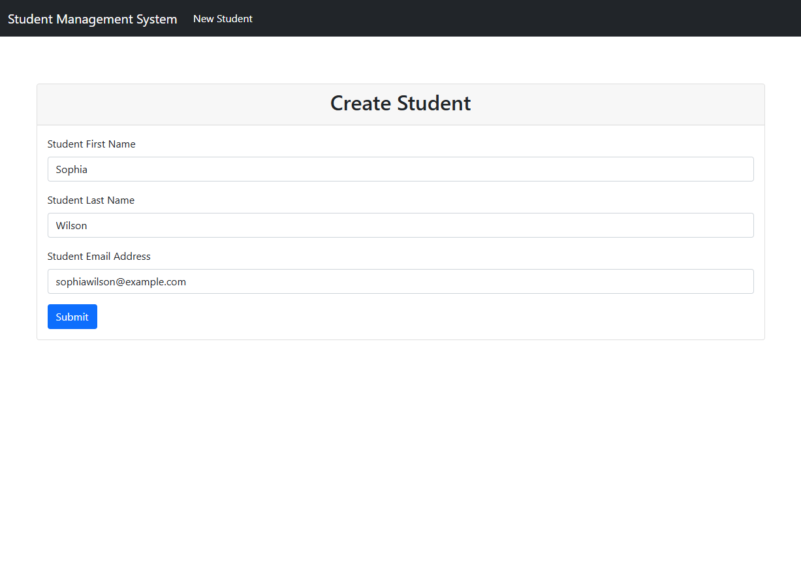
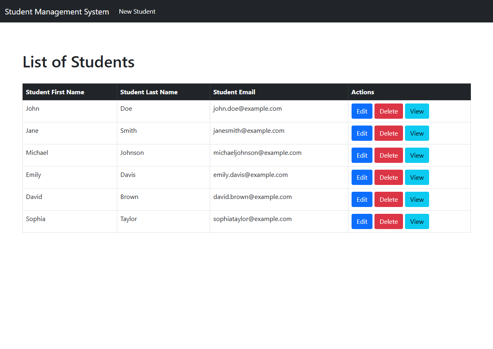
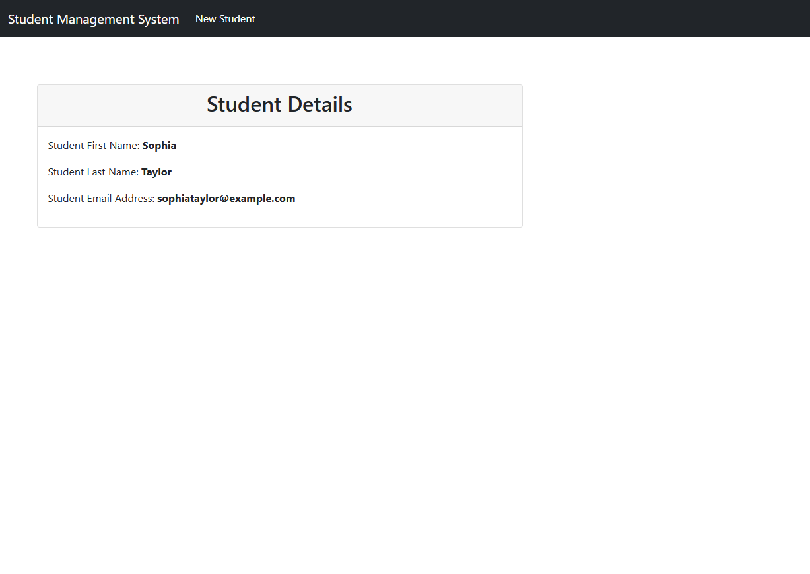

# Student Management System

This is a simple Student Management System developed using **Spring Boot** and **Hibernate**. The application provides functionality to add, update, delete, and view student records. It leverages a MySQL database for persistence and Spring MVC for web interface handling.

## Features
- Add, Update, Delete, and View Student Records
- Search for students
- Database integration with MySQL using Hibernate ORM

## Technologies Used
- **Backend:** Java, Spring Boot, Spring MVC, Hibernate
- **Database:** MySQL
- **Frontend:** HTML, CSS (for basic UI)

## Setup and Installation
1. Clone the repository:
   
   `git clone https://github.com/kapilmankar08/Student-Management-System.git`

3. Navigate to the project directory:

    `cd Student-Management-System`

4. Install dependencies using Maven:

    `mvn clean install`

5. Set up the MySQL database:
- Create a database (e.g., student_db) in MySQL.
- Update the application.properties file with your database credentials.

Sample Configuration.

    spring.datasource.url=jdbc:mysql://localhost:3306/student_db
    spring.datasource.username=root
    spring.datasource.password=yourpassword
    spring.jpa.hibernate.ddl-auto=update

5. Run the application:

    `mvn spring-boot::run`

## Usage
- Open your browser and go to http://localhost:8080/students to interact with the application.
- Use the interface to add, update, delete, or view student records.

#Screenshots

## License
- This project is licensed under the MIT License.
